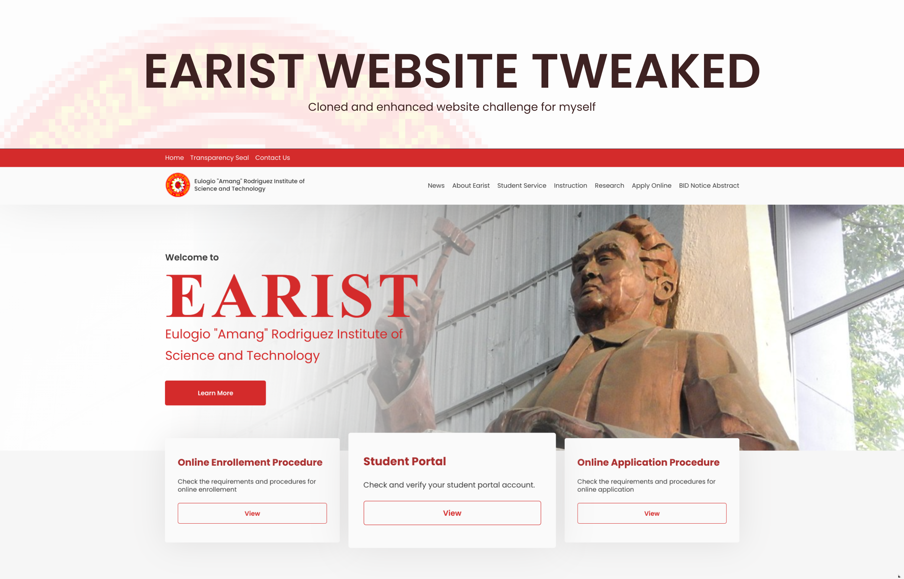

<!-- PROJECT LOGO -->
 

  

  <h3 align="center">EARIST Website Tweaked</h3>

  

This website is a replication of the Official EARIST College School Website with an enhanced User Interface.
     
     
    <a href="https://github.com/wardvisual/earist-website-tweaked"><strong>View Project »</strong></a>
         
     
    <a href="https://github.com/wardvisual/earist-website-tweaked">View Demo</a>
    ·
    <a href="https://github.com/wardvisual/earist-website-tweaked/issues">Report Bug</a>
    ·
    <a href="https://github.com/wardvisual/earist-website-tweaked/issues">Request Feature</a>
  

### Project Screenshot(s)

### Built With

- [HTML]()
- [CSS]()
- [VSCode]()

<!-- CONTACT -->

## Contact

Edward Fernandez - [@wardvisual](https://twitter.com/wardvisual)

Project Link: [earist-website-tweaked](https://github.com/wardvisual/earist-website-tweaked)
